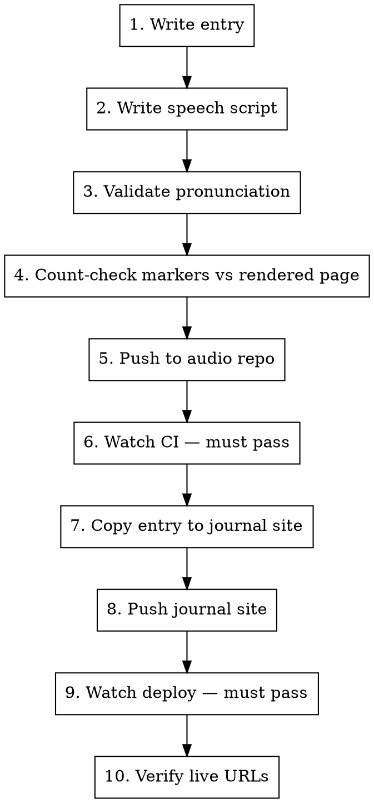

# Publish a Journal Entry

End-to-end pipeline for Shipping in the Dark journal entries. Every step, every validation gate, every failure mode.

## Paths

| What | Path |
|------|------|
| Entry source | `C:\Projects\NoMercy\journal\entries\{date}-{number}-{slug}.md` |
| Journal site | `C:\Projects\NoMercy\docs\shipping-in-the-dark\` |
| Journal site entries | `entries/` (root of journal site repo — build script copies to content collection) |
| Audio repo | `C:\Projects\NoMercy\docs\shipping-in-the-dark-audio\` |
| Speech scripts | `speeches/{slug}.speech.md` (entries) or `speeches/team/{slug}.speech.md` (team) |
| Pronunciation dict | `config/pronunciation.json` |
| Voice cast | `config/voices.json` |

## Pipeline



## Step 1: Write the Entry

Dispatch the **storyteller** agent. Entry file: `journal/entries/{date}-{number}-{slug}.md`

**Frontmatter (all required):**
```yaml
---
# --- IDENTITY ---
title: "Entry Title"
slug: entry-slug
date: YYYY-MM-DD
session_start: "HH:MM"
session_end: "HH:MM"
duration_minutes: N

# --- CLASSIFICATION ---
status: resolved | in-progress | blocked
severity: low | medium | high | critical
type: bugfix | feature-work | refactor | investigation | feature-work-and-bugfix

# --- SCOPE ---
projects:
  - project-name

components:
  - Component description

# --- PEOPLE ---
agents:
  - agent-id

human_mood: descriptive-mood

# --- TRACEABILITY ---
commits: []
related_entries: []

tags:
  - tag1
  - tag2

# --- SERIES (optional) ---
series: "Series Name"
series_order: N

# --- AUDIO (fill after step 6) ---
audio_url: "https://github.com/NoMercy-Entertainment/shipping-in-the-dark/releases/download/audio-v1/{slug}.mp3"
vtt_url: "/audio/{slug}.vtt"

# --- META ---
reading_level: beginner | intermediate | intermediate-to-advanced | advanced
excerpt: "One-line SEO description"
---
```

**Content rules:**
- Every `##` heading needs a corresponding `<!-- h-N -->` in the speech script later
- Every `<p>` in the rendered output needs a `<!-- p-N -->` in the speech script later
- Write in Ink's voice (the storyteller)

## Step 2: Write the Speech Script

Dispatch the **speech-director** agent. File: `speeches/{slug}.speech.md`

**Structure:**
```markdown
# Speech Script: {Title}

**Entry:** {number}
**Source:** `entries/{date}-{number}-{slug}.md`
**Narrator:** Aria (en-US-AriaNeural) — Ink narrates
**Estimated duration:** ~N minutes
**Script author:** Echo

---

[narrator:dramatic]

{Title}.

[pause:900ms]

<!-- h-1 -->
[narrator:reflective]
{First heading text}.

[pause:300ms]

<!-- p-1 -->
[narrator:reflective]
{First paragraph text, adapted for speech...}

[pause:600ms]

<!-- h-2 -->
[narrator:matter-of-fact]
{Second heading text}.
```

**Critical rules:**
- Every rendered `<h2>` / `<h3>` → `<!-- h-N -->` marker (sequential)
- Every rendered `<p>` → `<!-- p-N -->` marker (sequential)
- Markers must be sequential: h-1, p-1, h-2, p-2, p-3, h-3, p-4...
- NO inline `[pronunciation: X]` tags — the synth script applies `config/pronunciation.json` automatically
- Use `...` (ellipsis) for mid-sentence pauses, NOT em dashes (TTS reads through `—`)
- Use `[pause:Nms]` between paragraphs (300-1000ms)
- Write numbers as digits when TTS might mispronounce: "4 years" not "Four years"
- Use `{{N}}` around numbers for clean TTS: `{{008}}` → "008"
- Title spoken BEFORE first `<!-- h-1 -->` as a `--` prefixed line or plain narrator text
- Voice tags: `[narrator:style]` for Ink, `[voice:agent-id]` for quotes

**Available narrator styles:** dramatic, reflective, matter-of-fact, tense, serious, cozy

## Step 3: Validate Pronunciation

Read `config/pronunciation.json`. For every technical term in the speech script:

1. Check if it has a `sub` entry (NOT just `ipa` — edge-tts ignores IPA)
2. If missing `sub`, add one before pushing
3. Watch for: acronyms, camelCase, PascalCase, project names, agent names, non-English words

**Common traps:**
- Single-letter names get swallowed → use full name with spell-out sub
- `sub` does raw `str.replace()` → beware matching inside other words
- Only `sub` entries work with edge-tts. `ipa` and `say-as` do nothing.

## Step 4: Count-Check Markers

**This step prevents the #1 failure mode: audio out of sync with page.**

1. Render the entry locally or check the existing page structure
2. Count `<h2>`, `<h3>` headings in the prose → must match `h-N` count in speech script
3. Count `<p>` paragraphs in the prose → must match `p-N` count in speech script
4. Verify markers are sequential with no gaps

```bash
# After entry is on journal site, verify:
curl -s "https://journal.nomercy.tv/entry/{slug}/" | grep -oE 'data-audio-h="h-[0-9]+"' | wc -l
curl -s "https://journal.nomercy.tv/entry/{slug}/" | grep -oE 'id="p-[0-9]+"' | wc -l
# Compare with:
grep -c '<!-- h-' speeches/{slug}.speech.md
grep -c '<!-- p-' speeches/{slug}.speech.md
```

## Step 5: Push to Audio Repo

```bash
cd C:\Projects\NoMercy\docs\shipping-in-the-dark-audio
git add speeches/{slug}.speech.md config/pronunciation.json
git commit -m "feat(audio): add speech script for Entry {N} — {slug}"
git push origin master
```

**Only the changed speech script and config will trigger regeneration** (the CI has change detection).

If config changed → all audio regenerates. If only one speech script → only that one.

## Step 6: Watch CI

```bash
# Find the run
gh run list --repo NoMercy-Entertainment/shipping-in-the-dark-audio --limit 1

# Watch it — MUST pass
gh run watch {run-id} --repo NoMercy-Entertainment/shipping-in-the-dark-audio --exit-status
```

**If CI fails:** Check logs with `gh api repos/NoMercy-Entertainment/shipping-in-the-dark-audio/actions/jobs/{job-id}/logs`. Common failures:
- edge-tts network timeout → retry the run
- ffmpeg timeout → already set to 60s, should not happen
- Empty output → check speech script syntax (missing `[narrator:X]` before text)

**CI auto-deploys:** MP3 to GitHub Release `audio-v1`, VTTs to journal site repo. No manual copy needed.

## Step 7: Copy Entry to Journal Site

```bash
cp "C:\Projects\NoMercy\journal\entries\{date}-{N}-{slug}.md" \
   "C:\Projects\NoMercy\docs\shipping-in-the-dark\entries\"
```

The `entries/` dir is at the ROOT of the journal site repo. The build script `copy-content.mjs` copies from there to `site/src/content/entries/` at build time.

## Step 8: Push Journal Site

```bash
cd C:\Projects\NoMercy\docs\shipping-in-the-dark
git add entries/{date}-{N}-{slug}.md
git commit -m "feat(journal): Entry {N} — {Title}"
git push origin master
```

## Step 9: Watch Deploy

```bash
gh run list --repo NoMercy-Entertainment/shipping-in-the-dark --limit 1
gh run watch {run-id} --repo NoMercy-Entertainment/shipping-in-the-dark --exit-status
```

## Step 10: Verify Live

ALL THREE must return 200:

```bash
# Entry page
curl -s -o /dev/null -w "%{http_code}" "https://journal.nomercy.tv/entry/{slug}/"

# Audio MP3 (302 = redirect to CDN = exists)
curl -s -o /dev/null -w "%{http_code}" "https://github.com/NoMercy-Entertainment/shipping-in-the-dark/releases/download/audio-v1/{slug}.mp3"

# VTT sync file
curl -s -o /dev/null -w "%{http_code}" "https://journal.nomercy.tv/audio/{slug}.vtt"
```

Then verify VTT has proper markers:
```bash
curl -s "https://journal.nomercy.tv/audio/{slug}.vtt" | head -20
# Must show h-N and p-N cues, NOT -- prefixed text
```

## Failure Modes (from 2026-04-13 session)

| Failure | Cause | Prevention |
|---------|-------|------------|
| Audio doesn't sync with page | Speech script missing `h-N`/`p-N` markers | Step 4 count-check |
| TTS mispronounces terms | Dictionary has `ipa` but no `sub` | Step 3 validation |
| VTTs deployed but page shows old audio | Journal site needs rebuild after VTT push | CI auto-triggers deploy — just watch it |
| CI generates 0 files | Artifact path mismatch (fixed) or empty speech | CI now validates output is non-empty |
| All 46 files regenerate on small change | No change detection (fixed) | CI diffs HEAD~1, only regenerates changed scripts |
| `git push` fails in CI | Parallel CI runs racing | CI now does `pull --rebase` before push |
| Single-letter name swallowed by TTS | TTS drops standalone "A" | Use full name with `sub` in pronunciation dict |
| Em dashes read as silence | TTS reads through `—` | Use `...` for pauses |

## Do NOT

- Use `[pronunciation: X]` inline in speech scripts — TTS reads them aloud
- Generate audio locally — CI on beast-unit parallelizes and deploys
- Commit specs/plans/design docs to the repo
- Add `Co-Authored-By` to commits
- Add `Closes #N` in commits during dev
- Publish without verifying audio (step 10)
- Use the Write tool on existing files — use Edit to preserve line endings
- Skip watching CI — "it probably passed" has failed every time
